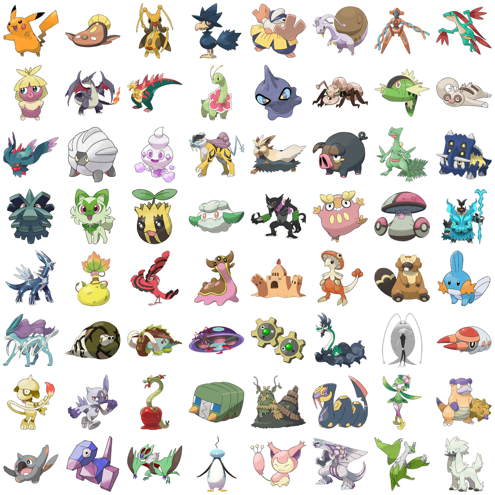

# Neural Pokédex — a Pokémon GAN, served from Django

Generates original creature designs from a **FastGAN written from scratch in
PyTorch**, trained on official Pokémon artwork (Gen 1–9), and served as a live
web app whose backend is Django.

Two constraints shaped every decision in here, and both are worth stating up
front because they are the interesting part of the problem:

1. **The dataset is tiny.** 2,666 official-artwork files, and after
   near-duplicate removal only **2,231 images — ~1,308 of them structurally
   distinct**. Worse, Pokémon are wildly diverse in shape: birds, blobs,
   machines, dragons. FastGAN's showcase few-shot results are on *homogeneous*
   sets like shells or portraits. This is a much harder few-shot problem than
   the image count alone suggests.
2. **The GPU is an RTX 3050 Laptop with 4GB of VRAM.** That rules out
   StyleGAN2-ADA locally and caps the local model at 256×256.



*The training set after preprocessing: tight-cropped, scale-normalised, composited over white.*

### What to expect from the output

Recognisably creature-like shapes with plausible Pokémon palettes, coherent
shading, and frequently incoherent limbs. That is a good result for this data
budget. It will **not** produce clean, anatomically correct Gen-9-quality
artwork, and no amount of tuning on a 4GB card will change that — the lever
that closes most of the remaining gap is transfer learning from a pretrained
model on a cloud GPU (see [Stretch goals](#stretch-goals)).

---

## Quick start

```bash
pip install -r requirements/train.txt
python -m src.data.download            # ~2,666 files, ~344MB
python -m src.data.preprocess --resolution 256
python -m src.train --name fastgan --steps 100000
```

Then export and serve:

```bash
python -m src.export_onnx checkpoints/fastgan/final.pt --out server/models/generator.onnx --fp16
cd server && python manage.py migrate && python manage.py runserver
```

---

## Running the training over several nights

The full run is ~37 h on a 4 GB card, so it is built to be stopped and
restarted. Ctrl-C at any time; the last checkpoint is at most 2,000 steps back.

```bash
python -m src.train --name fastgan --resume checkpoints/fastgan/latest.pt
```

Checkpoints carry G, D, the EMA copy, both optimizer states, the AMP scaler and
the fixed sample latents, and are written to a temp file then atomically
renamed — a crash mid-save cannot destroy the last good one.

Watch progress:

```bash
tensorboard --logdir runs/
```

**The one metric to actually watch is `acc_real` / `acc_fake`.** If both sit
near 1.0 for a sustained stretch, the discriminator has memorised the training
set and the run is wasted — stop and check that DiffAugment is being applied to
fakes as well as reals. Healthy training keeps both meaningfully below 1.0.

Sanity-check the architecture before committing 37 hours (~3 minutes):

```bash
python -m src.capacity_check --images 16 --steps 1500
```

This fits G to real images with a plain reconstruction objective and **no
discriminator**. If it cannot reach L1 < 0.08, the generator cannot represent
the data and no amount of adversarial training will fix that.

Note the obvious alternative — "overfit 20 images with augmentation off" — is
*not* a valid architecture test for a GAN. D memorises 20 images within ~1,000
steps, its accuracy saturates near 1.0, and G stops receiving gradient, so the
run fails regardless of whether the architecture is sound. Measured in
[results.md](docs/results.md#architecture-sanity--and-why-the-planned-gate-was-replaced).

---

## How it works

### Data (`src/data/`)

`download.py` enumerates the artwork id space and probes
`raw.githubusercontent.com` directly rather than asking the GitHub tree API.
The API allows only 60 unauthenticated requests/hour and its `recursive=1`
listing for this repo comes back `truncated: true` — which silently drops
files. Probing costs a few hundred cheap 404s and needs no quota at all.
(`--listing api` still does an exact tree walk if you have quota.)

`preprocess.py` does three things that each measurably matter:

| Step | Why |
|---|---|
| Composite alpha onto white | Training stays 3-channel. A learned alpha channel is near-binary and makes tanh generators produce halos; transparency is recovered at serve time by matting instead. |
| Tight-crop to the alpha bbox, centre on a square canvas | Normalises subject scale. Raw artwork frames Wailord and Joltik very differently; removing that variance is free model capacity. `--no-tight-crop` builds the control set. |
| Dedupe on pHash **and** colour | See below. |

**The dedupe bug worth knowing about.** pHash is computed on luminance and is
therefore colour-blind. A shiny is structurally identical to its base form, so
pHash alone flagged **952 of 1,327 shinies as duplicates** — discarding exactly
the palette diversity shinies were included for. Requiring a match on *both*
pHash and a coarse RGB signature drops that to 435 genuine near-duplicates and
keeps 923 shinies.

Shinies still contribute **zero shape diversity**. The honest structural
dataset size is ~1,308, and that is the number to reason about.

### Model (`src/models/fastgan.py`)

Faithful implementation of Liu et al., ICLR 2021. Two ideas carry it:

- **Skip-Layer Excitation** — a channel-wise gate carried from a low-res
  feature map to a high-res one (4×4→64, 8×8→128, 16×16→256) via a 4×4 pooled
  conv. Long-range conditioning at almost no parameter cost, which is what
  keeps a 29M-parameter generator inside 4GB.
- **Self-supervised discriminator** — D reconstructs real images (whole,
  downsampled, and a random quadrant) from its own features via three small
  decoders. On ~1.3k images D would otherwise memorise the set within a few
  thousand steps; forcing it to remain a useful encoder is what keeps the
  adversarial signal alive.

Plus **DiffAugment** (`src/augment.py`) applied to reals *and* fakes in *both*
the G and D passes. Applying it asymmetrically is the classic bug and just
hands D a free tell.

### Measured cost on the 4GB card

| batch | recon loss | peak VRAM | s/step | 100k steps |
|---|---|---|---|---|
| 8 | vgg | **2.72 GiB** | 1.34 | ~37 h |
| 8 | mse | 2.28 GiB | 1.47 | ~41 h |
| 4 | vgg | 1.78 GiB | 0.72 | ~20 h |

Batch 8 with the paper-faithful VGG perceptual reconstruction fits comfortably,
so it is the default. Drop to `--recon-loss mse` only if a run OOMs.

### Evaluation (`src/metrics.py`)

**KID is the headline metric, not FID.** FID's covariance estimate is badly
biased below ~2,048 samples and there are only ~2.2k images total, so a bare
FID here is close to meaningless — quoting one anyway is the standard mistake
in Pokémon-GAN write-ups. FID is still reported with its sample count attached.

The **nearest-neighbour panel** is a first-class result, not an extra: with a
dataset this small, showing that generated images are *not* near-copies of
training art is the difference between a generative model and an expensive
lookup table.

### Serving (`server/`)

The design choice that makes free hosting work:

- **`POST /api/generate` does no inference.** It picks seeds and returns markup
  pointing at `GET /g/<seed>-<psi>.png`.
- **That GET is deterministic and immutable.** A seed fully determines the
  image, so every result is a shareable permalink and is cached forever.
  Repeat traffic costs zero CPU.
- **ONNX, not PyTorch.** torch on CPU is ~800MB installed / ~300MB resident and
  does not fit a 512MB tier. onnxruntime (~50MB) plus the fp16 generator
  (~60MB) lands at ~250–300MB resident.

| Route | Purpose |
|---|---|
| `GET /` | HTMX page — count, seed, truncation slider |
| `POST /api/generate` | Pick seeds, return result markup |
| `GET /g/<seed>-<psi>.png` | Deterministic render; `?bg=transparent` mattes the white ground |
| `GET /i/<a>-<b>.png` | Spherical-interpolation strip between two seeds |
| `POST /api/like/<seed>-<psi>` | Save to the hall of fame |
| `GET /healthz` | Liveness + whether the model actually loaded |

Deploy target is **Render's free tier** — the only real free tier left among
Render / Railway / Fly.io (Railway ended theirs in 2023, Fly.io is trial-only).
It spins down after 15 min idle, giving a 30–60s cold start.

---

## Stretch goals

1. **StyleGAN2-ADA transfer learning on Kaggle** (30 free GPU-hrs/week, 16GB).
   Fine-tune from a pretrained AFHQ/FFHQ checkpoint with `--freezed=13`. By a
   wide margin the largest available quality win on a dataset this small. Both
   models export to ONNX and drop behind the same Django endpoint.
2. **512×512** — cloud only, unreachable on 4GB.
3. **Type-conditional generation** via a projection discriminator, using the
   type metadata already collected in `data/raw/meta.json`. Flagged honestly:
   18 types over ~1,308 structural images is ~70 per type, which is genuinely
   data-starved. Coarse type groups first; "it didn't work" is a legitimate
   result to report.

---

## Legal

Pokémon artwork is © Nintendo / Creatures Inc. / GAME FREAK, and the
`PokeAPI/sprites` repo states no explicit license.

- **The dataset is never committed.** `data/` is gitignored; use `download.py`.
- Non-commercial only — no ads, no paid tier.
- The site carries a visible "unofficial fan project, not affiliated with
  Nintendo" disclaimer.
- Trained weights derived from copyrighted art are legally unsettled. Normal
  practice and low-risk for a personal portfolio piece, but publish them with
  the same disclaimer and be ready to take them down on request.
