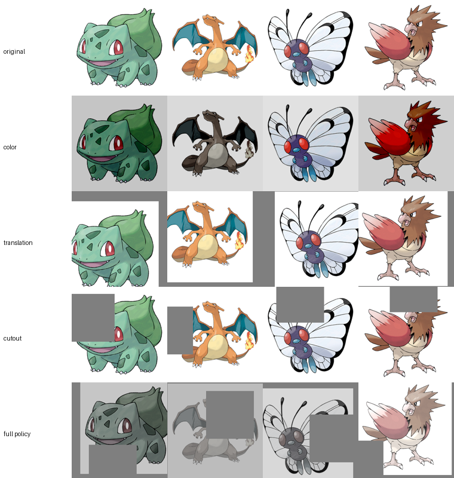

# Pipeline

Every stage, what it produces, and the decisions inside it that actually
changed the outcome.

---

## 0. Download — `src/data/download.py`

```bash
python -m src.data.download --workers 16
```

**Output:** `data/raw/official-artwork/{normal,shiny}/*.png`, `manifest.json`,
`meta.json`. ~344 MB.

| | |
|---|---|
| normal | 1,339 |
| shiny | 1,327 |
| **total** | **2,666** |
| Gen 9 (dex ≥ 906, normal) | 434 |
| probed but absent | 384 |

### Why the listing probes the CDN instead of using the GitHub API

The obvious approach — `GET /repos/PokeAPI/sprites/git/trees/master?recursive=1`
— has two failure modes that bit during development:

1. **It returns `truncated: true` for this repo.** The response silently drops
   files. Any count derived from it is wrong, and wrong in a way that looks
   fine.
2. **60 requests/hour unauthenticated.** Trivially exhausted; the first real
   run died on a 403 with a 42-minute reset.

Since every artwork file is named exactly `<id>.png`, the id space can be
enumerated directly (1–1025 for the national dex, 10001–10500 for form
variants) and probed against `raw.githubusercontent.com`, which is a CDN with
no comparable limit. Misses return 404 and are dropped. 384 wasted requests is
a good trade for never touching a rate-limited API.

`--listing api` still does an exact, per-directory tree walk (never
`recursive=1`) if you have quota and want the precise listing.

**Type metadata** is fetched per-type (18 requests) rather than per-Pokémon
(~1,300). Same data, ~70× fewer requests, far kinder to PokeAPI's fair-use
policy.

---

## 1. Preprocess — `src/data/preprocess.py`

```bash
python -m src.data.preprocess --resolution 256
```

**Output:** `data/processed/256/*.png` + `manifest.csv`.

```
source: 2666 files at 256px, tight_crop=True
dedupe: dropping 435 near-duplicates (hamming <= 4 AND colour delta <= 0.02)
kept  : 2231  (1308 normal, 923 shiny)
```

Generation coverage of the kept set:

| Gen | 1 | 2 | 3 | 4 | 5 | 6 | 7 | 8 | 9 | forms |
|---|---|---|---|---|---|---|---|---|---|---|
| n | 260 | 179 | 247 | 172 | 268 | 132 | 158 | 159 | 199 | 457 |

### Composite onto white, don't learn alpha

Source artwork is RGBA with a transparent ground. Training on 4 channels is
tempting — the web app could then serve transparent PNGs directly — but alpha
in this data is effectively binary (0 or 255), and a `tanh` generator asked to
produce a near-binary channel produces halos around every edge. Training stays
3-channel over white; transparency is recovered at serve time by matting
(`?bg=transparent`). The tradeoff is that genuinely white subjects get partly
matted away, which is why the opaque version is the default.

### Tight crop normalises scale

Crop to the alpha bounding box, then centre on a square canvas sized
`max(w,h) × (1 + 2·margin)`. Raw artwork frames Wailord and Joltik very
differently; that scale variance is something the model would otherwise have to
spend capacity modelling. Centring on a fresh canvas rather than clamping the
crop to the source bounds matters — clamping would silently rescale the
subject, reintroducing exactly the variance being removed.

`--no-tight-crop` writes to `data/processed/256-uncropped/` so the two can be
compared directly.

### The dedupe bug — colour-blind pHash

The first implementation used pHash alone at Hamming ≤ 4:

```
dedupe: dropping 989 near-duplicates (hamming <= 4)
kept  : 1677  (1302 normal, 375 shiny)
```

**952 of 1,327 shinies were dropped.** pHash is computed on luminance, so it
cannot see colour at all — and a shiny is structurally *identical* to its base
form. The filter was discarding exactly the palette diversity shinies were
included for, while flagging almost nothing else.

The fix requires agreement on both axes: pHash Hamming ≤ 4 **and** mean
absolute difference over an 8×8 RGB thumbnail ≤ 0.02.

```
dedupe: dropping 435 near-duplicates (hamming <= 4 AND colour delta <= 0.02)
kept  : 2231  (1308 normal, 923 shiny)
```

The 435 still dropped are genuine: 37 near-identical cosmetic form variants
(mostly ids 10027–10032 and similar) plus ~400 shinies whose recolour really is
negligible.

### The number that actually matters

Shinies add palette diversity and **zero shape diversity**. The honest
structural dataset size is **~1,308 images**, and that is what to reason about
when thinking about mode coverage or memorisation risk — not 2,231.

---

## 2. Baseline — DCGAN @ 64px

`src/models/dcgan.py`. Faithful to Radford et al. 2016, checkerboard artefacts
included, because FastGAN's nearest-upsample-then-conv is one of the things
being compared against.

Exists to validate the loop end to end, to give `results.md` a "colourful
blobs" reference point, and to demonstrate mode collapse first-hand.

---

## 3. FastGAN @ 256px — `src/models/fastgan.py`, `src/train.py`

```bash
python -m src.train --name fastgan --steps 100000
python -m src.train --name fastgan --resume checkpoints/fastgan/latest.pt
```

29.1M parameter generator, 11.5M parameter discriminator.

### Skip-Layer Excitation

A channel-wise gate carried from a low-res feature map to a high-res one
(4×4→64, 8×8→128, 16×16→256) via `pool→conv4×4→Swish→conv1×1→sigmoid`, then
multiplied. Long-range conditioning at almost no parameter cost — global
structure at 8×8 directly modulating detail at 128×128 without a deep trunk.
This is what keeps the model inside 4GB.

The pooling is **static, not adaptive** (`low_size` is passed at construction).
`adaptive_avg_pool2d` cannot be exported to ONNX once any axis is dynamic, and
the export needs a dynamic batch axis. Discovered only by attempting the export
early — worth doing before a 38-hour run, not after.

### Self-supervised discriminator

D reconstructs real images from its own features through three small decoders:
the whole image from the final 8×8 map, the downsampled image from the small
branch, and a random quadrant of the 16×16 map. Reconstruction loss applies to
**real images only**.

This is the single most important regulariser at this dataset size. Without it,
D memorises ~1.3k images within a few thousand steps and the adversarial signal
dies.

### DiffAugment

Colour, translation (±1/8) and cutout (½), applied to **reals and fakes, in
both the G and D passes**. The ops are differentiable, so gradients reach G and
it never learns to reproduce the augmentation artefacts. Applying it
asymmetrically — only to reals — is the classic bug: it just hands D a free
tell and quietly degrades everything.

### Measured on the RTX 3050 Laptop (4GB)

| batch | recon | peak VRAM | s/step | 100k steps |
|---|---|---|---|---|
| 8 | vgg | **2.72 GiB** | 1.34 | ~37 h |
| 8 | mse | 2.28 GiB | 1.47 | ~41 h |
| 4 | vgg | 1.78 GiB | 0.72 | ~20 h |
| 4 | mse | 1.58 GiB | 0.69 | ~19 h |

Batch 8 with the paper-faithful VGG perceptual reconstruction fits with room to
spare, so it is the default — the plan had hedged on needing an MSE fallback
and that turned out to be unnecessary. Batch 8 is also the paper's own setting,
so `grad_accum` stays at 1; raising it doubles wall clock for a marginal gain.

Memory savings that made this fit: fakes are generated under `no_grad` during
the D phase (D's update never needs G's graph), AMP fp16 autocast, and
channels-last layout.

### Resume is mandatory, not a nicety

A full run is ~38h and has to survive being stopped nightly; Kaggle's 12h
session cap makes it non-negotiable for the cloud runs. Checkpoints carry G, D,
the EMA copy, both optimizer states, the AMP scaler and the fixed sample
latents, and are written to a temp file then atomically renamed so a crash
mid-save never destroys the last good one.

### DiffAugment, verified visually



Rows: original, colour, translation (zero-padded), cutout, and the full policy.
Gradients were confirmed to flow through the whole policy — that is the part
that matters, and the part a broken implementation silently loses.

### Watch `acc_real` / `acc_fake`

Sustained ~1.0 on both means D has memorised the set — the exact failure mode
DiffAugment exists to prevent. If that happens, DiffAugment is misapplied.

Measured on the two runs, which differ only in augmentation:

| run | dataset | augment | acc_real / acc_fake |
|---|---|---|---|
| `overfit20` | 20 | off | 0.998 / 0.995 — memorised |
| `fastgan` | 2,231 | on | **0.70 / 0.67** — healthy |

### Sanity-check the architecture first — `src/capacity_check.py`

Before committing ~37 hours, confirm the generator can represent the data at
all. This drops the discriminator entirely and fits G with an L1 reconstruction
objective, learning one latent per image:

```
L1: 0.8067 -> 0.0505  (94% reduction)   VERDICT: PASS
```

It takes ~3 minutes and is unambiguous. The alternative that suggests itself —
overfitting a handful of images with augmentation off — is *not* a valid
architecture test here: D memorises them within ~1,000 steps and starves G of
gradient, so the run fails either way and tells you nothing about the
architecture.

---

## 4. Evaluation — `src/metrics.py`

```bash
python -m src.metrics checkpoints/fastgan/final.pt --json docs/results.json
```

**KID is the headline number.** FID's covariance estimate is badly biased below
~2,048 samples and there are only ~2.2k images total. FID is reported with its
sample count attached and should be treated as indicative only.

The **nearest-neighbour panel** is a result, not a garnish: at ~1,308 distinct
shapes, demonstrating that outputs are not near-copies of training art is the
difference between a generative model and an expensive lookup table.

Features come from torchvision's Inception-V3, which differs slightly from the
original TF-Inception graph. Numbers are comparable *between runs in this repo*
and only roughly comparable to published figures.

---

## 5. Export — `src/export_onnx.py`

```bash
python -m src.export_onnx checkpoints/fastgan/final.pt \
    --out server/models/generator.onnx --fp16
```

Three transforms happen before tracing, each for a concrete reason:

| Transform | Why | Effect |
|---|---|---|
| Deterministic noise | `NoiseInjection` draws fresh noise per forward, so the same seed would render a different image every time — destroying the permalink and cache design. Noise is zero-mean, so dropping it yields the exact expected output. | Also removes the `RandomNormalLike` nodes the fp16 converter cannot handle |
| Fold spectral norm | A training-time Lipschitz constraint that keeps both `weight_orig` and `weight` alive in the graph | 222 MB → 111 MB |
| Single-output wrapper | The 128px branch only exists to feed D's second scale | smaller graph |

Then fp16: **111 MB → 55.6 MB**.

Parity against the torch model is asserted, and the export refuses to ship if
it fails:

```
folded spectral norm on 18 modules
deterministic noise on 6 NoiseInjection modules
parity: max |diff| = 0.00006, mean = 0.00001 (tolerance 0.01)
parity OK
```

> **Note for anyone exporting an untrained model:** parity will fail with
> `max |diff| = 2.0`. That is not an export bug. Untrained BatchNorm running
> stats are still at init while real activations reach ~1e16, so `tanh`
> saturates to exactly ±1 and trivial numerical noise flips signs. Warm the BN
> statistics (or use a real checkpoint) and parity is exact.

---

## 6. Serve — `server/`

```bash
cd server && python manage.py migrate && python manage.py runserver
python manage.py test generator gallery      # 24 tests
```

The design that makes free hosting work: `POST /api/generate` performs **no
inference**. It picks seeds and returns markup pointing at
`GET /g/<seed>-<psi>.png`, which is deterministic and served with
`Cache-Control: immutable, max-age=31536000`. Every image is a shareable
permalink and repeat traffic costs zero CPU.

Resident memory: Django ~80 MB + onnxruntime ~50 MB + fp16 model ~56 MB ≈
250–300 MB, inside Render's 512 MB free tier. Serving PyTorch instead would
have been ~300 MB for torch alone and would not fit.
