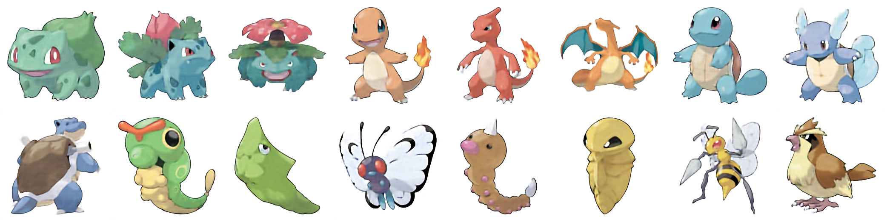

# Results

Measurements recorded as they land. Anything not yet measured is marked
**pending** rather than estimated — see [Status](#status).

---

## Dataset

| | |
|---|---|
| Source files downloaded | 2,666 (1,339 normal + 1,327 shiny) |
| After near-duplicate removal | **2,231** (1,308 normal + 923 shiny) |
| **Distinct shapes** | **~1,308** |
| Gen 9 entries (normal, dex ≥ 906) | 434 |
| Resolution | 256×256 RGB, tight-cropped, white ground |

Shinies are recolours: they contribute palette diversity and no shape
diversity. Every claim about mode coverage or memorisation should be read
against **1,308**, not 2,231.

### Dedupe ablation

| Criterion | dropped | kept | shinies kept |
|---|---|---|---|
| pHash only (Hamming ≤ 4) | 989 | 1,677 | 375 / 1,327 |
| **pHash AND colour (≤ 0.02)** | **435** | **2,231** | **923 / 1,327** |

pHash runs on luminance and is colour-blind, so on its own it treats every
shiny as a duplicate of its base form — discarding 72% of them. Requiring
agreement on shape *and* palette is the fix. Details in
[pipeline.md](pipeline.md#the-dedupe-bug--colour-blind-phash).

---

## Training cost — RTX 3050 Laptop, 4 GB

Measured over 3 full train steps each (D pass + G pass, AMP fp16,
channels-last), not estimated.

| batch | recon loss | peak VRAM | s/step | 100k steps |
|---|---|---|---|---|
| 8 | vgg | **2.72 GiB** | 1.34 | **~37 h** |
| 8 | mse | 2.28 GiB | 1.47 | ~41 h |
| 4 | vgg | 1.78 GiB | 0.72 | ~20 h |
| 4 | mse | 1.58 GiB | 0.69 | ~19 h |

**The plan hedged on needing an MSE fallback for the reconstruction loss; that
turned out to be unnecessary.** The paper-faithful VGG perceptual term costs
only ~0.44 GiB more than MSE and fits batch 8 comfortably, so it is the
default.

Model sizes: generator 29.1 M parameters, discriminator 11.5 M.

---

## Export

| Stage | Size |
|---|---|
| ONNX fp32, spectral norm attached | 222.5 MB |
| ONNX fp32, spectral norm folded | 111.2 MB |
| **ONNX fp16 (shipped)** | **55.6 MB** |

Parity against the torch EMA model, same latents:

| | max abs diff | mean abs diff |
|---|---|---|
| fp32 | 0.000000 | 0.000000 |
| fp16 | 0.000082 | 0.000010 |

Tolerance is 1e-2; the export refuses to write a model that fails it.

**Determinism verified:** the same seed produces byte-identical PNGs across
repeated requests. This is load-bearing — the immutable cache headers and
permalink URLs are only correct because of it. It required explicitly disabling
the stochastic `NoiseInjection` term at inference (see
[pipeline.md](pipeline.md#5-export--srcexport_onnxpy)).

---

## Serving

24 tests pass (`python manage.py test generator gallery`), covering route
behaviour, determinism, immutable cache headers, white-matte transparency,
slerp norm preservation, gallery like-counting, and hostile input clamping.

### Measured resident memory

Docker is not installed on this machine, so the plan's `docker run -m 512m`
check was replaced with a direct process measurement of a fully warmed serving
process — the same number the container limit governs.

| stage | RSS | peak |
|---|---|---|
| bare python | 17 MB | 17 MB |
| + django | 46 MB | 46 MB |
| + index rendered (loads ONNX session) | 199 MB | 341 MB |
| + 1 image (cold) | 252 MB | 341 MB |
| + 10 more images (warm) | 273 MB | 341 MB |
| + 8-frame interpolation strip | **376 MB** | **396 MB** |

**116 MB headroom** under the 512 MB tier. Latency: 0.29 s cold (including
loading the 55.6 MB graph), 0.31 s warm per image — inside the plan's ~2 s
budget.

#### A real bug this caught

The first measurement peaked at **581 MB** and would have OOM'd on Render.
Cause: `/i/<a>-<b>.png` ran all 8 interpolation frames as a single ONNX batch,
and a 29M-parameter generator's intermediate activations scale with batch size.
Every other route was fine at ~273 MB because it renders one image.

Fix: inference runs in chunks of `GENERATOR_CHUNK_SIZE` (default 2) and
concatenates. Peak fell to 396 MB. The cost is wall time on the first request
only — the immutable cache absorbs the rest.

*(Still pending: a real `docker run -m 512m` on a machine with Docker. A slim
Linux container is typically somewhat lower than this Windows figure, and
gunicorn adds one worker's overhead on top.)*

---

## Architecture sanity — and why the planned gate was replaced

The plan specified: *overfit 20 images with augmentation off; if the model
cannot reproduce them, the architecture is wrong.* **That gate is not
diagnostic for a GAN, and running it demonstrated why.**

With 20 images and no augmentation the discriminator memorises the set almost
immediately. Measured over 2,000 steps:

| step | acc_real | acc_fake | recon |
|---|---|---|---|
| 100 | 0.906 | 0.883 | 10.53 |
| 1,100 | 0.989 | 0.988 | 8.09 |
| 1,300 | 0.998 | 0.995 | 6.66 |

Once D is at ~0.99 on both, it supplies almost no usable gradient and G stops
improving — the step-2,000 samples were *less* structured than the step-1,000
ones. The run fails whether or not the architecture is sound, so it cannot
distinguish the two cases. It is a good demonstration of *why DiffAugment is
necessary*, and a bad test of the generator.

### What replaced it — `src/capacity_check.py`

Remove the discriminator entirely and ask the question directly: can the
generator represent real images? Fit G to a fixed batch with an L1
reconstruction objective, learning one latent per image alongside the weights.

```
fitting 16 images for 1500 steps (no discriminator)
L1: 0.8067 -> 0.0505  (94% reduction)
VERDICT: PASS
```



All 16 targets reconstructed recognisably, down to Butterfree's wing pattern,
Beedrill's stingers and the flame on Charmander's tail. **The generator has
ample capacity and a clean gradient path**; the adversarial blobs were purely
D-dominance dynamics.

This runs in ~3 minutes and is unambiguous, which makes it the right gate
before committing tens of hours.

---

## DiffAugment, measured

The two runs differ only in whether DiffAugment is applied:

| run | dataset | augment | acc_real / acc_fake |
|---|---|---|---|
| `overfit20` | 20 images | **off** | 0.998 / 0.995 (D has memorised) |
| `fastgan` | 2,231 images | **on** | **0.70 / 0.67** (healthy) |

Keeping D away from saturation is the entire job, and it is doing it.

---

## Model quality

**Pending — the full run is in progress** (100,000 steps, ETA ~39 h at
0.71 it/s).

To be filled in once it finishes:

| Model | steps | KID ↓ | FID (indicative) | notes |
|---|---|---|---|---|
| DCGAN 64px | — | — | — | baseline, expected to be poor |
| FastGAN 256px | — | — | — | main model |
| StyleGAN2-ADA transfer | — | — | — | stretch goal, cloud GPU |

**KID is the headline metric.** FID's covariance estimate is badly biased below
~2,048 samples and there are only ~2.2k images total; any FID quoted here
carries its sample count and should be read as indicative only.

Also pending:

- Nearest-neighbour memorisation panel — at ~1,308 distinct shapes, showing
  outputs are *not* near-copies of training art is a core result.
- Truncation sweep (ψ = 0.3 … 1.2).
- Latent interpolation strips.
- Failure-mode gallery. More informative than the cherry-picks, so it ships.

---

## Status

| Phase | State |
|---|---|
| 0 · Data pipeline | **done** — 2,231 images verified 256×256 RGB, visually inspected |
| 1 · DCGAN baseline | implemented, **not yet trained** — it shares the one GPU with Phase 2 |
| 2 · FastGAN architecture | **done** — shapes, VRAM, and generator capacity all verified |
| 2 · FastGAN training | **running** — 100k steps, ~39 h, resumable |
| 3 · Evaluation | implemented, **awaiting a trained checkpoint** |
| 4 · Django backend | **done** — 24 tests passing, driven end-to-end in a browser |
| 5 · Deploy config | Dockerfile + render.yaml + [deploy.md](deploy.md), **not yet deployed** |
| 6 · Stretch goals | not started |

### Bugs caught before they cost anything

| Bug | Would have caused | Caught by |
|---|---|---|
| pHash dedupe is colour-blind | 952 of 1,327 shinies silently deleted | checking *what* dedupe removed, not just how many |
| `AdaptiveAvgPool2d` will not export to ONNX with a dynamic batch axis | a full retrain after the run finished | attempting the export before training, not after |
| `NoiseInjection` re-randomised every forward | same seed → different image, invalidating every permalink and cache header | asserting byte-identical output for a repeated request |
| interpolation ran 8 frames as one ONNX batch | 581 MB peak → OOM on a 512 MB tier | measuring resident memory instead of estimating it |
| the planned overfit gate is not diagnostic | ~37 h spent on an unvalidated architecture, or a sound one wrongly rejected | running the gate and questioning the result |

### Honest expectation for Phase 2

At 256×256 on ~1,308 structurally distinct images spanning birds, blobs,
machines and dragons, the realistic ceiling is recognisably creature-like
shapes with plausible palettes and shading, and frequently incoherent limbs.
That is a good result for this data budget.

It will not reach clean, anatomically coherent Gen-9-quality artwork, and no
amount of tuning on a 4 GB card will change that. The lever that closes most of
the remaining gap is StyleGAN2-ADA transfer learning from a pretrained
checkpoint on a free cloud GPU — Phase 6, item 1.
